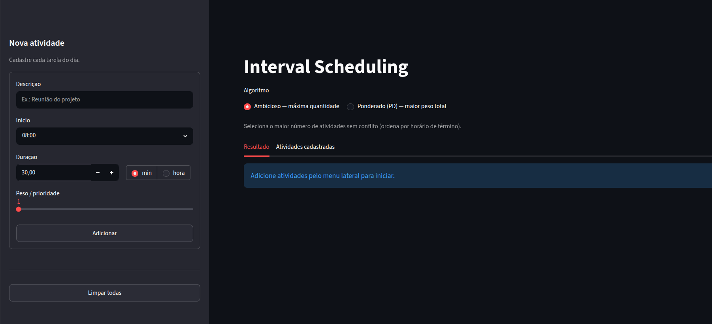
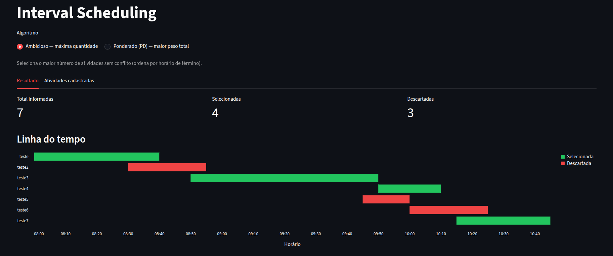
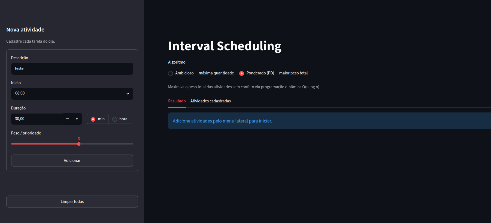
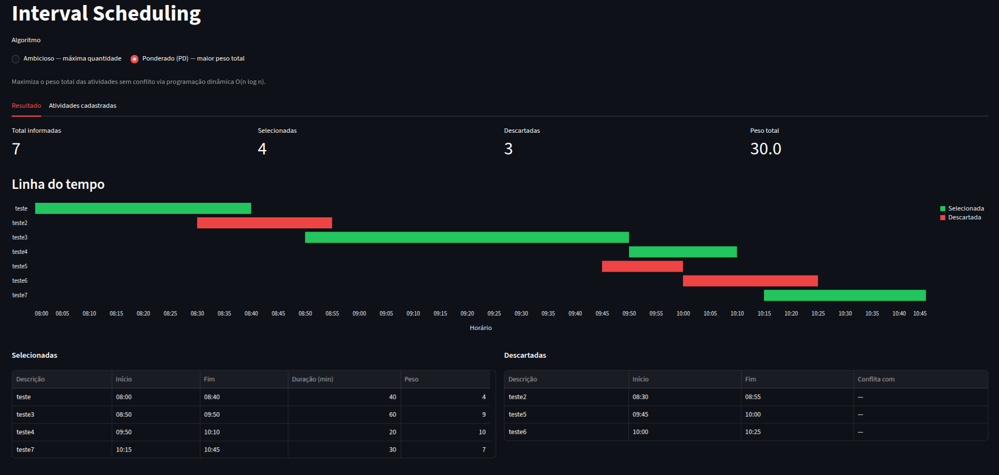

# G34_Programacao_Dinamica_PA-26.1

Conteúdo da Disciplina: Programação Dinâmica<br>

## Alunos
|Matrícula | Aluno |
| -- | -- |
| 211062867  |  Felipe de Jesus Rodrigues |
| 211043763  |  Ruan Sobreira Carvalho |

## Sobre 
Projeto G34: Planejador diário com dois modos de agendamento de atividades:

- **Ambicioso — Interval Scheduling:** seleciona o maior *número* de atividades sem sobreposição, ordenando pelo horário de término (earliest deadline first).
- **Ponderado — Weighted Interval Scheduling (PD):** seleciona o subconjunto de atividades sem sobreposição que maximiza o *peso total* (prioridade), usando programação dinâmica bottom-up com busca binária para o predecessor compatível.

**Funcionalidades:**
- **Algoritmos em `interval_scheduling.py`**: `schedule_activities` (ambicioso O(n log n)) e `weighted_schedule_activities` (PD O(n log n)), além da lógica de detecção de conflitos `find_conflicting_activity`.
- **App web Streamlit (`app.py`)**:
  - Cadastro e visualização de atividades com linha do tempo interativa (Altair) e métricas estilizadas.
  - Edição direta de atividades na tabela com recálculo automático de duração.
  - Aba de **Funcionamento (DP)** exibindo passo a passo a tabela de programação dinâmica, predecessor $p(j)$ e o valor ótimo $OPT(j)$ calculado.
  - Exibição de com qual atividade selecionada cada atividade descartada conflita.
- **CLI (`main.py`)**: Modo texto completo, incluindo relatório de conflitos e maior peso total no modo ponderado.
- **Testes Unitários**: Testes robustos cobrindo todas as funções e algoritmos do projeto.

## Screenshots

### Algoritmo Ambicioso

Tela principal com o formulário lateral para cadastro de atividades (descrição, horário de início, duração e peso), além das abas de resultado e atividades cadastradas.



Resultado do agendamento ambicioso: métricas de total informadas, selecionadas e descartadas, seguido da linha do tempo visual com atividades em verde (selecionadas) e vermelho (descartadas).



### Algoritmo Ponderado (Programação Dinâmica)

Toggle de algoritmo selecionado em **Ponderado (PD)**, com o campo de peso/prioridade no formulário lateral.



Resultado do agendamento ponderado: métrica de peso total obtido e linha do tempo com o subconjunto de maior peso sem sobreposição.



## Instalação 
**Linguagem:** Python 3.10+  
**Framework:** Streamlit + Pandas + Altair  

1. Clone o repositório.
2. Instale dependências:  
   ```
   pip install -r requirements.txt
   ```

## Uso 

### Web App
```
streamlit run app.py
```
- Abra http://localhost:8501.
- Cadastre atividades pelo menu lateral (descrição, início, duração em min ou horas e peso/prioridade).
- Escolha o algoritmo acima das abas: **Ambicioso** (máxima quantidade) ou **Ponderado (PD)** (maior peso total).
- Veja na aba **Resultado** a linha do tempo e as tabelas de selecionadas/descartadas.
- Edite ou remova atividades na aba **Atividades cadastradas**.

### CLI
```
python main.py
```
- Selecione o modo: `1` para ambicioso ou `2` para ponderado (PD).
- Informe cada atividade (descrição, horário de início no formato `HH:MM`, duração, unidade e peso se modo ponderado).
- Responda `s` para adicionar mais atividades ou `n` para encerrar.
- O relatório lista as atividades selecionadas (com peso total no modo ponderado) e as descartadas.

### Testes Unitários
```
python -m unittest test_interval_scheduling.py
```
- Executa os testes automatizados que cobrem os algoritmos (ambicioso e ponderado), tratamento e validação de dados.

## Outros 
- **Algoritmo ambicioso:** Interval Scheduling Maximization — O(n log n), critério: menor horário de término.
- **Algoritmo PD:** Weighted Interval Scheduling — O(n log n), recorrência `OPT(j) = max(w_j + OPT(p(j)), OPT(j−1))` onde `p(j)` é o predecessor compatível mais tardio, calculado via busca binária (`bisect_right`). Solução recuperada por backtracking na tabela de DP.
- Projeto acadêmico G34 - Projeto de Algoritmos 2026.1.

## Vídeo apresentação

O vídeo de apresentação pode ser acessado clicando no link abaixo.

[Apresentação](https://youtu.be/)
